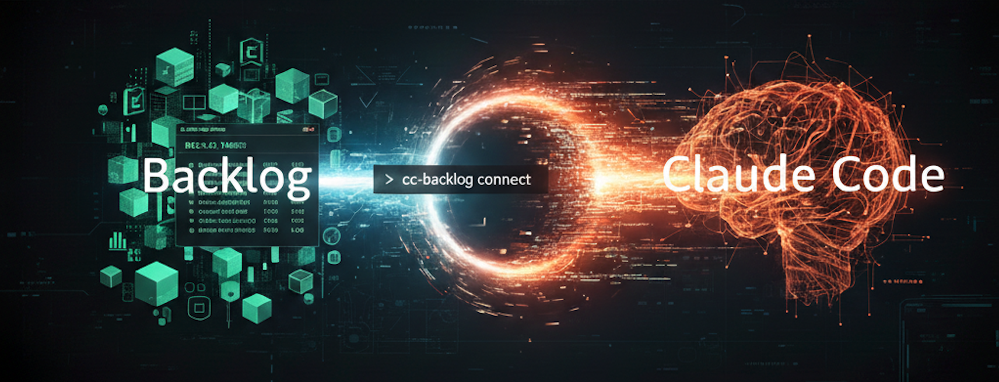

# cc-backlog-connect - Backlog × Claude Code 連携プラグイン




Nulab Backlog の課題・カスタムフィールド・コメント・Wiki・ドキュメントを Claude Code から直接操作できる Claude Code CLI プラグイン。  
Backlog API を介して課題の参照・作成・更新・同期を行い、AI コーディングアシスタントにプロジェクト管理のコンテキストを与えます。

## cc-backlog-connect とは

cc-backlog-connect は、[Nulab Backlog](https://backlog.com/) と [Claude Code](https://docs.anthropic.com/en/docs/claude-code/overview) を接続する Claude Code CLI プラグインです。  
開発中に Backlog
の課題・コメント・Wiki を離れることなく参照・操作できるため、コンテキストスイッチを削減し、AI 支援の開発ワークフローを効率化します。

## 特徴

- **課題の CRUD 操作** — Backlog 課題の取得・作成・更新・削除・検索をコマンドラインから実行
- **高度なフィルタリング** — 種別・カテゴリー・マイルストーン・担当者・キーワードで課題を絞り込み検索
- **カスタムフィールド** — 定義一覧の取得、課題の値の読み書き、型に合わせた検索・件数取得・同期に対応
- **コメント管理** — 課題へのコメント追加・一覧・更新・削除を Claude Code 内で完結
- **Wiki 操作** — Backlog Wiki ページの閲覧・作成・編集をターミナルから直接実行
- **ドキュメント操作** — Backlog 階層型 Document（Wiki とは別機能）の一覧・ツリー表示・取得・作成・削除に対応
- **ローカル同期** — Backlog 課題を Markdown ファイルとしてローカルに同期（フィルタ付き同期対応）
- **Read/Write モード** — デフォルト read モードで書き込み操作を安全にガード。明示的に write モードを有効化して操作
- **レート制限管理** — API レート制限状況の表示、プロアクティブスロットリング、正確なリトライ制御
- **プロアクティブ Skills** — 会話中に課題キー（例: `PROJ-123`）や Wiki ページ名を言及するだけで、自動的に Backlog API から情報を取得
- **プロジェクト単位の設定** — プロジェクトごとに異なる Backlog スペースへ接続可能

## なぜ必要か

開発タスクの仕様や議論は Backlog の課題・コメントに集約されています。  
しかし Claude Code はローカルファイルの読み書きは得意でも、外部の Backlog API に直接アクセスすることはできません。

cc-backlog-connect を導入すると:

1. **Backlog の課題情報をローカル Markdown に同期** — Claude Code が自然に仕様・議論を参照可能に
2. **CLI から Backlog を直接操作** — ブラウザを開かずに課題の作成・ステータス更新・コメント追加
3. **プロアクティブ Skills で自動取得** — 「PROJ-123 を確認して」と言うだけで課題情報を即座に表示

## インストール

### 1. Claude Code プラグインとして登録

```bash
/plugin marketplace add TakashiKakizoe1109/cc-backlog-connect
/plugin install cc-backlog-connect
```

登録後、Claude Code 内でスラッシュコマンドとプロアクティブ Skills が使用可能になります。

依存関係のインストールとビルドは SessionStart フックで自動実行されます（`smart-install.sh`）。  
SessionStart が未実行の場合は `bash "${CLAUDE_PLUGIN_ROOT}/scripts/smart-install.sh"` を実行してください。`scripts/cc-backlog.sh` から起動する場合にも同じ確認を行います。`node dist/index.js` や npm の `cc-backlog` はビルド済みファイルを直接実行します。  
バージョン変更やソース更新時のみ再実行されるため、セッション起動への影響は最小限です。

### 2. Backlog API 接続設定

Claude Code 内で `/cc-backlog-connect:config` を実行し、Backlog スペースの接続情報を設定します:

```
set --space <スペース名> --api-key <APIキー> --project-key <プロジェクトキー> --mode <read|write>
```

| パラメータ         | 説明                              | 例                                                   |
|---------------|---------------------------------|-----------------------------------------------------|
| `space`       | Backlog スペース名                   | `test-company` → `https://test-company.backlog.com` |
| `api-key`     | Backlog API キー（個人設定 > API から発行） | —                                                   |
| `project-key` | 対象プロジェクトキー                      | `PROJ`                                              |
| `mode`        | 操作モード（デフォルト: `read`）            | `read`（読み取りのみ） / `write`（書き込み許可）                     |

> **安全ガード**: デフォルトは `read` モードです。課題の作成・更新・削除、コメントの追加、Wiki・ドキュメントの書き込みには `write` モードを有効にしてください。課題取得・検索・メタデータ参照・ローカル同期は `read` モードで利用できます。

設定は `{プロジェクトルート}/.cc-backlog/config.json` に保存されます。API キーを含むため、`.gitignore` に追加してください。

## 使い方

### スラッシュコマンド（Claude Code 内で実行）

```
/cc-backlog-connect:config                     # Backlog API 接続設定の表示・変更
/cc-backlog-connect:sync                       # 未完了の課題をローカルに同期
/cc-backlog-connect:sync --all                 # 完了済みを含む全課題を同期
/cc-backlog-connect:sync --issue PROJ-123      # 特定の課題のみ同期
/cc-backlog-connect:sync --status "処理中"       # ステータス名で絞り込み同期
/cc-backlog-connect:sync --type "タスク"         # 種別名で絞り込み同期
/cc-backlog-connect:sync --assignee "yamada"   # 担当者名で絞り込み同期
/cc-backlog-connect:sync --priority "高"        # 優先度名で絞り込み同期
/cc-backlog-connect:sync --keyword "検索語"      # キーワードで絞り込み同期
/cc-backlog-connect:sync --parent-child 1      # 親課題のみ同期（子課題除外）
```

### プロアクティブ Skills — 会話中の自動 Backlog 連携

プロアクティブ Skills を使えば、Claude Code との会話の中で自然に Backlog の情報を取得・操作できます。課題キーや操作意図を含む発言を検知し、適切な Backlog API を自動実行します。

| 発言例                              | 発動する Skill        | 実行される操作          |
|----------------------------------|-----------------|----------------|
| 「PROJ-123 の課題を見せて」               | backlog-issue   | 課題の詳細を取得         |
| 「ステータスを完了にして」                    | backlog-issue   | 課題ステータスを更新       |
| 「バグの課題を種別で検索して」                  | backlog-issue   | フィルタ付き課題検索       |
| 「PROJ-123 にコメントして」               | backlog-comment | 課題にコメントを追加       |
| 「Backlog Wiki の設計ドキュメントを参考にして」   | backlog-wiki    | Wiki ページを取得      |
| 「Backlog ドキュメントのツリーを見せて」         | backlog-document | ドキュメント階層ツリーを表示  |
| 「Backlog ドキュメントを追加して」            | backlog-document | ドキュメントを作成       |
| 「Backlog の種別一覧を見せて」              | project-info    | プロジェクトメタデータを取得   |

### カスタムフィールド（カスタム属性）

Backlog API のカスタム属性を既存の課題コマンドで扱えます。まず定義一覧からフィールド ID、型、選択肢 ID、必須設定、適用する課題種別を確認してください。

```bash
# 定義一覧（read モードで実行可能）
node "${CLAUDE_PLUGIN_ROOT}/dist/index.js" project-info custom-fields --refresh

# 課題を作成: 101 はテキスト、102 は数値、103 は複数選択の例
node "${CLAUDE_PLUGIN_ROOT}/dist/index.js" issue create \
  --summary "調査依頼" --type-id 1 --priority-id 3 \
  --custom-fields '{"101":"顧客からの依頼","102":0,"103":[11,12]}'

# 値を更新（write モードが必要）
node "${CLAUDE_PLUGIN_ROOT}/dist/index.js" issue update PROJ-123 \
  --custom-fields '{"102":5}'

# 数値の範囲と選択肢で検索。count / sync でも同じ JSON を使用可能
node "${CLAUDE_PLUGIN_ROOT}/dist/index.js" issue search \
  --custom-field-filters '{"102":{"min":0,"max":10},"103":[11,12]}'
```

すでに同期した課題へカスタムフィールドを反映する場合は、`sync --issue PROJ-123 --force` など対象を絞って再同期してください。`--force` はローカルの同期ファイルを上書きするため、手元の編集は先に退避してください。

例の ID は実際のプロジェクトの ID に置き換えてください。JSON は ID をキーにしたオブジェクトを一度だけ指定します。日付は `"YYYY-MM-DD"`、選択肢は表示名ではなく数値 ID です。課題取得の JSON と同期した `issue.md` にはカスタムフィールドの値も含まれます。

書き込み・検索時は対象プロジェクトの定義を取得し、型、選択肢、適用種別、範囲を検証します。指定しないフィールドは送信しません。`null` や空配列による値の削除、定義自体の作成・変更・削除には対応していません。詳細と「その他」入力の形式は [カスタムフィールドのリファレンス](plugin/skills/backlog-issue/reference.md#カスタムフィールド) を参照してください。

## 同期データの出力フォーマット

`cc-backlog sync` で同期された課題は、プロジェクトルート配下に Markdown ファイルとして出力されます。Claude Code はこれらのファイルを自動的にコンテキストとして参照できます。

`sync` 実行時に、**プラグイン利用先プロジェクト**の `docs/backlog/.gitignore`（`*\n!.gitignore`）を自動生成するため、Backlog 同期ファイルの誤コミットを防ぎます。

### 課題ファイル — `docs/backlog/{PROJ-123}/issue.md`

```markdown
# [PROJ-123] 課題タイトル

- **URL**: https://test-company.backlog.com/view/PROJ-123
- **Status**: In Progress
- **Type**: Task
- **Priority**: Normal
- **Assignee**: Takashi Kakizoe
- **Created**: 2026-02-18
- **Updated**: 2026-02-18

## Description

課題の説明文
```

### コメントファイル — `docs/backlog/{PROJ-123}/comments.md`

```markdown
# Comments: [PROJ-123] 課題タイトル

## Takashi Kakizoe (2026-02-18 10:30)

コメント内容

---

## Another User (2026-02-18 14:00)

別のコメント
```

### 同期の挙動

| 状況       | 挙動                                                    |
|----------|-------------------------------------------------------|
| 初回同期     | 全対象課題を取得し `docs/backlog/` に書き出し                        |
| 2 回目以降   | 既存ファイルはスキップ（`--force` で上書き可能）                          |
| 単一課題指定   | `--issue PROJ-123` で特定課題のみ取得                           |
| フィルタ同期   | 名前ベース: `--status`, `--type`, `--assignee`, `--priority`, `--category`, `--milestone`, `--version`, `--created-user`, `--resolution`, `--keyword`<br>ID ベース: `--status-id`, `--type-id`, `--assignee-id`, `--priority-id`, `--category-id`, `--milestone-id`, `--version-id`, `--created-user-id`, `--resolution-id`<br>カスタムフィールド: `--custom-field-filters`（JSON）<br>親子関係: `--parent-child`（0=全て 1=子課題除外 2=子課題のみ 3=どちらでもない 4=親課題のみ） |
| マークアップ変換 | Backlog 独自マークアップは変換せずそのまま保存                            |

## 対応する Backlog API

cc-backlog-connect は [Nulab Backlog API](https://developer.nulab.com/docs/backlog/) の以下のエンドポイントを使用しています:

- 課題（Issues）: 取得 / 作成 / 更新 / 削除 / 検索 / 件数取得
- コメント（Comments）: 一覧 / 追加 / 取得 / 更新 / 削除
- Wiki: 一覧 / 取得 / 作成 / 更新 / 削除 / 件数取得
- ドキュメント（Documents）: 一覧 / ツリー取得 / 取得 / 添付ファイルダウンロード / 作成 / 削除
- プロジェクト情報: ステータス / 種別 / 優先度 / 完了理由 / ユーザー / カテゴリ / バージョン / カスタムフィールド定義 / レート制限

## Contributing

[CONTRIBUTING.md](CONTRIBUTING.md) を参照してください。

## Security

[SECURITY.md](SECURITY.md) を参照してください。

## ライセンス

[MIT](LICENSE)
